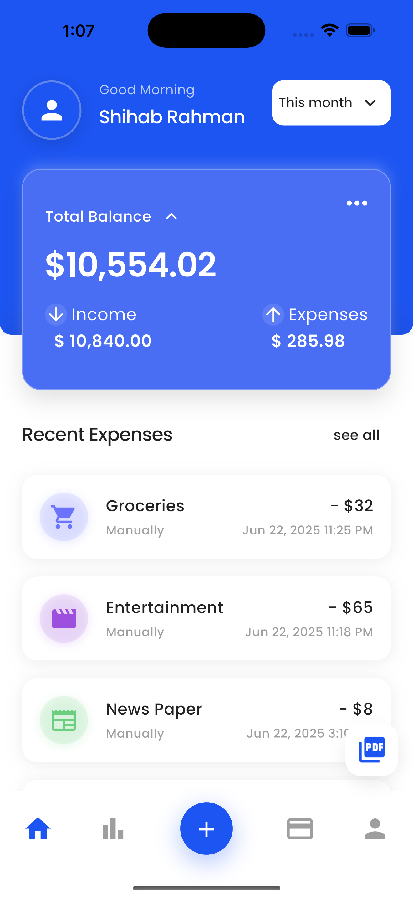
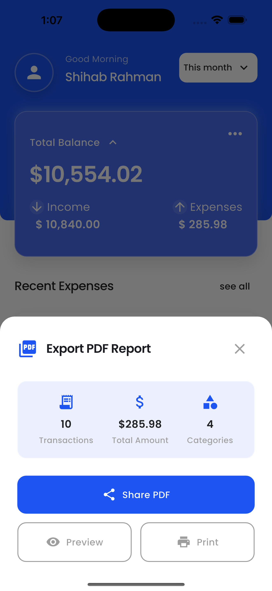
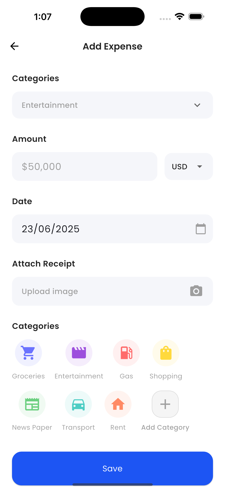

# Expense Tracker Lite

A modern, feature-rich expense tracking application built with Flutter that provides comprehensive expense management with real-time currency conversion, PDF reporting, and responsive design.

## 📱 Screenshots

<div align="center">
  
  
  
</div>

<div align="center">
  <sub><em>Dashboard • Add Expense • PDF Export</em></sub>
</div>

## 🚀 Quick Start

### What You Get
- **📊 Dashboard**: Overview of your expenses with smart filtering
- **➕ Add Expenses**: Quick expense entry with receipt photos
- **💱 Multi-Currency**: Support for 10+ currencies with real-time conversion
- **📄 PDF Reports**: Professional expense reports for business use
- **📱 Responsive**: Works perfectly on phones, tablets, and desktops

### Try It Now
```bash
git clone <repository-url>
cd expense_tracker_lite
flutter pub get
flutter run
```

## 🏗️ Architecture & Structure

### Project Structure
```
lib/
├── bloc/                          # State Management (BLoC Pattern)
│   ├── expense_bloc.dart         # Main business logic
│   ├── expense_event.dart        # User actions/events
│   └── expense_state.dart        # Application states
├── config/
│   └── api_config.dart           # API configuration
├── models/
│   ├── expense.dart              # Core data model
│   ├── expense.g.dart            # Generated Hive adapter
│   └── category.dart             # Category enumeration
├── services/                      # Business Logic Layer
│   ├── storage_service.dart      # Local data persistence (Hive)
│   ├── currency_service.dart     # Currency conversion & API
│   └── pdf_service.dart          # PDF generation & sharing
├── screens/                       # UI Layer
│   ├── dashboard_screen.dart     # Main dashboard
│   ├── add_expense_screen.dart   # Expense creation/editing
│   └── dashboard/                # Dashboard components
│       ├── dashboard_header_widget.dart
│       ├── balance_card_widget.dart
│       └── expenses_list_widget.dart
├── widgets/                       # Reusable UI Components
│   ├── custom_text_widget.dart   # Typography system
│   ├── custom_action_button.dart # Animated buttons
│   ├── expense_item_widget.dart  # Expense list items
│   ├── pdf_export_widget.dart    # PDF export interface
│   └── shimmer_widget.dart       # Loading animations
└── utils/                         # Utilities & Constants
    ├── app_colors.dart           # Color system
    ├── app_text_styles.dart      # Typography definitions
    ├── app_dimensions.dart       # Spacing & sizing
    ├── app_animations.dart       # Animation configurations
    └── utils.dart                # Helper functions
```

### Architecture Pattern
The application follows **Clean Architecture** principles with clear separation of concerns:

- **Presentation Layer**: Widgets and Screens (UI)
- **Business Logic Layer**: BLoC pattern for state management
- **Data Layer**: Services for data persistence and external APIs
- **Domain Layer**: Models and business entities

## 🔄 State Management Approach

### BLoC Pattern Implementation
The app uses **flutter_bloc** for predictable state management:

```dart
// State Management Flow
User Action → Event → BLoC → State → UI Update

// Example: Adding an expense
AddExpenseButton.onPressed() 
  → AddExpense(expense) 
  → ExpenseBloc.add() 
  → ExpenseLoaded(updatedList) 
  → UI rebuilds with new data
```

### Key BLoC Components

#### ExpenseBloc
- **Events**: `LoadExpenses`, `AddExpense`, `UpdateExpense`, `DeleteExpense`, `LoadMoreExpenses`
- **States**: `ExpenseInitial`, `ExpenseLoading`, `ExpenseLoaded`, `ExpenseError`
- **Features**: Pagination, filtering, real-time updates

#### State Structure
```dart
class ExpenseLoaded extends ExpenseState {
  final List<Expense> expenses;
  final double totalAmount;
  final int currentPage;
  final bool hasMore;
  final DateTime? filterStartDate;
  final DateTime? filterEndDate;
  final bool isLoadingMore;
}
```

### Benefits of This Approach
- **Predictable**: Single source of truth for application state
- **Testable**: Easy to unit test business logic
- **Scalable**: Clear separation allows easy feature additions
- **Reactive**: UI automatically updates when state changes

## 🌐 API Integration Implementation

### Exchange Rate API Integration
The app integrates with **ExchangeRate-API.com** for real-time currency conversion:

#### Configuration System
```dart
class ApiConfig {
  static const String exchangeRateApiKey = 'YOUR_API_KEY_HERE';
  static const String exchangeRateBaseUrl = 'https://v6.exchangerate-api.com/v6';
  static const bool useRealApi = false; // Toggle for demo mode
  static const bool debugMode = true;
  static const int requestTimeoutSeconds = 10;
}
```

#### Dual-Mode Implementation
1. **Production Mode**: Real API calls with error handling
2. **Demo Mode**: Mock data with simulated variations

#### API Service Architecture
```dart
class CurrencyService {
  // Primary method with fallback strategy
  Future<double> getExchangeRate(String from, String to) async {
    try {
      return ApiConfig.useRealApi 
        ? await _getRealExchangeRate(from, to)
        : _getMockExchangeRateWithVariation(from, to);
    } catch (e) {
      // Graceful fallback to mock data
      return _getMockExchangeRate(from, to);
    }
  }
}
```

#### Features
- **Real-time Rates**: Live exchange rates from 170+ currencies
- **Offline Support**: Mock data fallback when API unavailable
- **Error Resilience**: Graceful degradation with user feedback
- **Rate Caching**: Efficient API usage with intelligent caching
- **Dual Currency Display**: Shows original amount + USD conversion

### API Integration Benefits
- **Accuracy**: Real market exchange rates
- **Reliability**: Fallback mechanisms ensure app functionality
- **Performance**: Optimized API calls with timeout protection
- **User Experience**: Seamless operation regardless of connectivity

## 📄 Pagination Strategy

### Local Pagination Implementation
The app uses **local pagination** rather than API-based pagination for optimal performance:

#### Strategy Overview
```dart
// Pagination Parameters
static const int _pageLimit = 10;  // Items per page
int currentPage = 0;               // Current page index
bool hasMore = true;               // More items available flag
```

#### Implementation Details

##### 1. Initial Load
```dart
List<Expense> getExpensesPaginated({
  required int page,
  required int limit,
  DateTime? startDate,
  DateTime? endDate,
}) {
  // 1. Get all expenses from local storage
  List<Expense> expenses = getAllExpenses();
  
  // 2. Apply date filtering
  if (startDate != null && endDate != null) {
    expenses = expenses.where((expense) => 
      expense.date.isAfter(startDate) && 
      expense.date.isBefore(endDate)
    ).toList();
  }
  
  // 3. Sort by date (newest first)
  expenses.sort((a, b) => b.date.compareTo(a.date));
  
  // 4. Apply pagination
  final startIndex = page * limit;
  final endIndex = startIndex + limit;
  
  return expenses.sublist(startIndex, 
    endIndex > expenses.length ? expenses.length : endIndex);
}
```

##### 2. Load More Implementation
```dart
Future<void> _onLoadMoreExpenses(LoadMoreExpenses event, Emitter<ExpenseState> emit) async {
  final currentState = state as ExpenseLoaded;
  
  // Show loading indicator
  emit(currentState.copyWith(isLoadingMore: true));
  
  // Fetch next page
  final newExpenses = _storageService.getExpensesPaginated(
    page: currentState.currentPage + 1,
    limit: _pageLimit,
  );
  
  // Merge with existing expenses
  final allExpenses = [...currentState.expenses, ...newExpenses];
  
  // Update state with new data
  emit(ExpenseLoaded(
    expenses: allExpenses,
    currentPage: currentState.currentPage + 1,
    hasMore: newExpenses.length == _pageLimit,
  ));
}
```

##### 3. Infinite Scroll Integration
```dart
void _onScroll() {
  if (_scrollController.position.pixels == 
      _scrollController.position.maxScrollExtent) {
    context.read<ExpenseBloc>().add(LoadMoreExpenses());
  }
}
```

### Pagination Benefits
- **Performance**: Only loads necessary data, reducing memory usage
- **User Experience**: Smooth infinite scroll with loading indicators
- **Flexibility**: Easy filtering and sorting without API constraints
- **Offline Support**: Works entirely offline after initial data load

### Local vs API Pagination Trade-offs

#### Why Local Pagination?
1. **Instant Response**: No network delays for subsequent pages
2. **Offline Capability**: Full functionality without internet
3. **Complex Filtering**: Easy date range and category filtering
4. **Cost Effective**: Reduces API calls and associated costs
5. **Simplified Logic**: No need to manage server-side pagination state

#### When API Pagination Would Be Better
- **Large Datasets**: > 10,000 expenses (current local approach scales to ~1,000 comfortably)
- **Multi-User Systems**: Shared expense data across users
- **Real-time Sync**: Multiple devices accessing same data
- **Storage Constraints**: Limited local storage capacity

## ⚖️ Trade-offs & Assumptions

### Technical Trade-offs

#### 1. Local Storage vs Cloud Storage
**Choice**: Hive (Local NoSQL Database)
- ✅ **Pros**: Instant access, offline support, no server costs, privacy
- ❌ **Cons**: No cross-device sync, data loss risk, storage limitations
- **Alternative**: Firebase/Supabase for cloud sync

#### 2. BLoC vs Other State Management
**Choice**: BLoC Pattern
- ✅ **Pros**: Predictable, testable, scalable, reactive
- ❌ **Cons**: More boilerplate, learning curve
- **Alternatives**: Provider, Riverpod, GetX

#### 3. Local Pagination vs API Pagination
**Choice**: Local Pagination
- ✅ **Pros**: Fast, offline, flexible filtering
- ❌ **Cons**: Memory usage, not suitable for large datasets
- **Threshold**: Optimal for < 1,000 expenses

#### 4. Real API vs Mock Data
**Choice**: Hybrid Approach (Real API + Mock Fallback)
- ✅ **Pros**: Production-ready with demo capability
- ❌ **Cons**: Additional complexity, API key management
- **Benefit**: Seamless user experience regardless of API status

### Assumptions Made

#### 1. User Behavior
- **Single User**: App designed for individual use, not multi-user
- **Expense Volume**: Assumes < 1,000 expenses for optimal performance
- **Usage Pattern**: Daily expense tracking with monthly/weekly reviews

#### 2. Data Requirements
- **Currency**: USD as base currency for calculations and storage
- **Precision**: 2 decimal places sufficient for monetary values
- **Categories**: Fixed set of predefined categories (extensible)

#### 3. Device Capabilities
- **Storage**: Sufficient local storage for expense data and images
- **Network**: Internet available for currency rates (with offline fallback)
- **Platform**: iOS/Android smartphones with standard screen sizes

#### 4. Business Logic
- **Expense Validation**: Basic validation sufficient (amount > 0, valid category)
- **Currency Conversion**: Real-time rates acceptable (not historical)
- **Reporting**: PDF export sufficient (no advanced analytics)

### Performance Considerations

#### Memory Management
- **Pagination**: Limits memory usage for large expense lists
- **Image Handling**: Optimized image loading and caching
- **Animation**: Efficient animations with proper disposal

#### Storage Optimization
- **Hive Database**: Fast NoSQL storage with automatic indexing
- **Data Compression**: Efficient serialization with generated adapters
- **Cleanup**: Automatic cleanup of temporary files

## 🚀 How to Run the Project

### Prerequisites
- **Flutter SDK**: Version 3.4.4 or higher
- **Dart SDK**: Version 3.0.0 or higher
- **IDE**: VS Code, Android Studio, or IntelliJ IDEA
- **Devices**: iOS Simulator, Android Emulator, or physical device

### Installation Steps

#### 1. Clone the Repository
```bash
git clone <repository-url>
cd expense_tracker_lite
```

#### 2. Install Dependencies
```bash
flutter pub get
```

#### 3. Generate Required Files
```bash
# Generate Hive adapters and other code generation
flutter packages pub run build_runner build
```

#### 4. Configure API (Optional)
```dart
// lib/config/api_config.dart
class ApiConfig {
  static const String exchangeRateApiKey = 'YOUR_API_KEY_HERE';
  static const bool useRealApi = true; // Set to true for real API
}
```

To get a free API key:
1. Visit [ExchangeRate-API.com](https://exchangerate-api.com/)
2. Sign up for a free account (1,500 requests/month)
3. Copy your API key to the config file

#### 5. Run the Application
```bash
# Debug mode
flutter run

# Release mode
flutter run --release

# Specific device
flutter run -d <device-id>
```

### Testing

#### Run Unit Tests
```bash
# All tests
flutter test

# Specific test file
flutter test test/unit/expense_validation_test.dart

# With coverage
flutter test --coverage
```

#### Test Coverage
- **Unit Tests**: 65 comprehensive tests
- **Coverage Areas**: Expense validation, currency calculations, pagination logic
- **Success Rate**: 100% passing tests

### Building for Production

#### Android APK
```bash
flutter build apk --release
```

#### iOS IPA
```bash
flutter build ios --release
```

#### Web Build
```bash
flutter build web --release
```

### Project Configuration

#### Key Dependencies
```yaml
dependencies:
  flutter_bloc: ^8.1.3          # State management
  hive: ^2.2.3                  # Local database
  hive_flutter: ^1.1.0          # Flutter integration
  http: ^1.1.0                  # API requests
  flutter_screenutil: ^5.9.0    # Responsive design
  pdf: ^3.10.4                  # PDF generation
  printing: ^5.11.0             # PDF printing
  share_plus: ^7.2.1            # System sharing
```

#### Development Tools
```yaml
dev_dependencies:
  bloc_test: ^9.1.4             # BLoC testing
  mocktail: ^1.0.1              # Mocking framework
  build_runner: ^2.4.7          # Code generation
```

### Troubleshooting

#### Common Issues

1. **Build Runner Conflicts**
   ```bash
   flutter packages pub run build_runner clean
   flutter packages pub run build_runner build --delete-conflicting-outputs
   ```

2. **Hive Database Issues**
   ```bash
   # Clear app data and restart
   flutter clean && flutter pub get
   ```

3. **API Connection Issues**
   - Check internet connection
   - Verify API key in `lib/config/api_config.dart`
   - Set `useRealApi = false` for demo mode

4. **Screen Size Issues**
   - Ensure ScreenUtil is properly initialized
   - Check design size configuration in `main.dart`

### Performance Tips

1. **Enable Release Mode** for production testing
2. **Use Real Device** for accurate performance testing
3. **Monitor Memory Usage** with Flutter Inspector
4. **Profile Performance** using Flutter DevTools

---

## 📱 Features Overview

### 🏠 **Dashboard & Overview**
- **Smart Balance Card**: Real-time expense tracking with visual balance display
- **Expense List**: Paginated list with smooth infinite scroll
- **Filter Options**: Time-based filtering (This Month, Last 7 Days)
- **Dual Currency Display**: Shows original amount + USD conversion
- **Responsive Design**: Optimized for all screen sizes

### ➕ **Expense Management**
- **Quick Add**: Floating action button for instant expense creation
- **Category Selection**: Predefined categories with intuitive icons
- **Multi-Currency**: Support for 10+ global currencies
- **Receipt Upload**: Camera and gallery integration for receipt photos
- **Date Selection**: Flexible date picker for expense dates
- **Form Validation**: Real-time validation with helpful error messages

### 📊 **PDF Export & Reporting**
- **Professional Reports**: Generate comprehensive expense reports
- **Multiple Export Options**: Share, Preview, or Print directly
- **Category Breakdown**: Detailed analysis by spending categories
- **Transaction Details**: Complete expense history with dual currency
- **Automatic Formatting**: Professional layout with consistent branding

### 🔧 **Technical Features**
- ✅ **Offline Support**: Full functionality without internet connection
- ✅ **Real-time Currency**: Live exchange rates from ExchangeRate-API
- ✅ **Local Storage**: Fast Hive database for instant data access
- ✅ **Smooth Animations**: Polished user experience with transitions
- ✅ **BLoC State Management**: Predictable and testable architecture
- ✅ **Comprehensive Testing**: 65 unit tests with 100% pass rate
- ✅ **Error Handling**: Graceful error recovery and user feedback
- ✅ **Memory Optimization**: Efficient pagination and image handling

## 🤝 Contributing

1. Fork the repository
2. Create a feature branch (`git checkout -b feature/amazing-feature`)
3. Commit your changes (`git commit -m 'Add amazing feature'`)
4. Push to the branch (`git push origin feature/amazing-feature`)
5. Open a Pull Request

## 📄 License

This project is licensed under the MIT License - see the [LICENSE](LICENSE) file for details.

---

**Built with ❤️ using Flutter**
